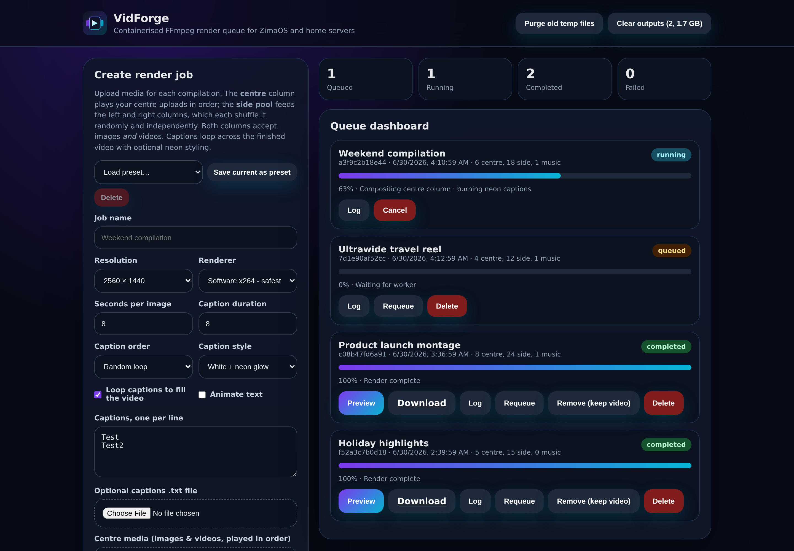
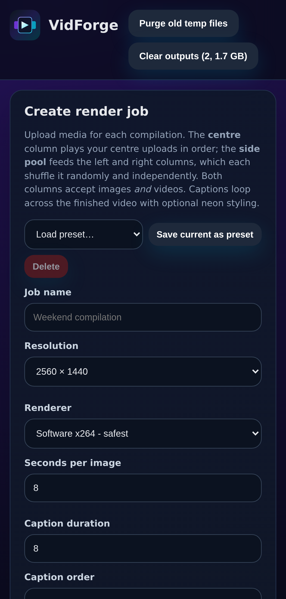

<div align="center">


# VidForge

**A Docker-first FFmpeg render queue for ZimaOS and home servers.**

Build polished three-section video compilations from your own images, videos, music and captions — all from a clean, responsive web dashboard.

[Deployment guide](DEPLOYMENT.md) · [Quick start](#quick-start) · [Features](#features) · [Configuration](#configuration)



</div>

---

## Overview

VidForge is a containerised web app that turns batches of media into a **three-column 1440p compilation**: a centre feature column flanked by left and right columns that shuffle from a shared media pool, with looping captions burned over the top.

It runs one render at a time through a lightweight built-in queue, so heavy FFmpeg jobs never collide on a small home server. It defaults to **portable software (x264) encoding**, so it works on AMD, Intel, ARM and VPS hosts without any Apple-only `h264_videotoolbox` dependency — while still offering optional hardware acceleration (VAAPI, Intel QSV, NVIDIA NVENC) when your host supports it.

## Features

- 🎬 **Three-section layout** — a centre column plus left/right columns composited into a single 1440p video.
- 🗂️ **Separate centre & side uploads** — the **centre** column plays your centre media in order; the **side pool** feeds the left and right columns, which each shuffle it **randomly and independently**. Both columns accept **images _and_ videos**.
- 🔁 **Looping captions** — type captions or upload a UTF-8 `.txt` file; loop them **randomly** or **sequentially** across the whole video.
- ✨ **Caption styling** — crisp white text wrapped in a dynamic **cyan + purple neon outline** (default) or a classic high-contrast **boxed** style. Optionally **animate** the captions so they gently pulse and bounce.
- 🎵 **Optional music** — drop in a track and it's looped (and trimmed) to match the video length.
- 🖥️ **Ultrawide support** — render at **2560×1440** or **3440×1440**.
- ⚡ **Encoder choices** — software **x264** by default, plus optional **VAAPI**, **Intel QSV** and **NVIDIA NVENC**.
- 📊 **Live dashboard** — real-time progress and stages, render logs, requeue, delete and download.
- 🛑 **Cancel running jobs** — stop a render that's taking too long; the active FFmpeg process is terminated and the job is marked cancelled.
- ▶️ **In-browser preview** — play a finished render right in the dashboard (HTTP range streaming) before downloading.
- 💾 **Reusable presets** — save the current render settings as a named preset and reload them with one click.
- 🧹 **Self-cleaning** — isolated per-job temp folders that are purged after each render, plus an automatic 12-hour cleanup of stale temp files. **Rendered videos are never auto-deleted** — you stay in control of your outputs.
- 🗑️ **Output management** — choose **Remove (keep video)** to clear a finished job from the queue while leaving its MP4 safely in the outputs folder, or **Delete** to remove the job and its video together. The header **Clear outputs** button (showing the current size) lets you purge orphaned videos, or all of them, on demand.
- 🔒 **Optional basic auth** — protect the dashboard with a username and password for shared networks.

## Quick start

The intended deployment pulls a prebuilt container image from the GitHub Container Registry (GHCR):

```
GitHub repo  ->  GitHub Actions  ->  GHCR image  ->  ZimaOS pulls image
```

### Docker Compose (recommended)

The default compose file pulls the published image — no source checkout or local build required:

```bash
docker compose up -d
```

Then open the dashboard:

```
http://YOUR-SERVER-IP:8080
```

### ZimaOS

Deploy the image directly in ZimaOS:

```
ghcr.io/backip210-pixel/vidforge:latest
```

Recommended container settings:

| Setting | Value |
| --- | --- |
| Port | `8080` (container) → `8080` (host) |
| Volume | `./data` → `/data` |
| Environment | `APP_DATA_DIR=/data`, `APP_PORT=8080`, `TEMP_MAX_AGE_HOURS=12` |

> **First run:** after the GitHub Actions workflow publishes the image, check the repo's **Packages** section. If ZimaOS cannot pull the image, make the GHCR package public or configure registry authentication on the host.

### Build from source (development)

```bash
docker compose -f docker-compose.build.yml up -d --build
```

## How a render works

Each job is built in stages and composited into the final 1440p frame:

```
┌──────────┬───────────────────────┬──────────┐
│   LEFT   │        CENTRE         │   RIGHT  │
│ (pool,   │  (your centre media,  │ (pool,   │
│  random) │   played in order)    │  random) │
│  images  │   images + videos     │  images  │
│ + videos │                       │ + videos │
└──────────┴───────────────────────┴──────────┘
            captions loop along the bottom
```

1. **Centre column** — built from your dedicated centre uploads (images and videos, in order). If you don't upload any, it falls back to the side pool; if that's empty too, it's a black column.
2. **Left & right columns** — each independently shuffles the shared side pool to fill the video's duration. Images become short clips (your *seconds per image*); videos play at their native length, scaled to fit the column.
3. **Composite** — the three columns are stacked side by side into one frame at your chosen resolution.
4. **Captions** — looped over the bottom in your chosen order and style.
5. **Music** (optional) — looped and trimmed to the video length, then muxed in.

Finished MP4s land in `data/outputs/` and can be previewed or downloaded from the dashboard.

## Configuration

Set these as environment variables (see [`.env.example`](.env.example)):

| Variable | Default | Description |
| --- | --- | --- |
| `APP_DATA_DIR` | `/data` | Root folder for jobs, outputs, temp files and state. |
| `APP_PORT` | `8080` | Port the web server listens on. |
| `APP_HOST` | `0.0.0.0` | Bind address. |
| `TEMP_MAX_AGE_HOURS` | `12` | Age after which idle temp folders are purged. |
| `APP_USERNAME` | _(unset)_ | Enable HTTP basic auth (with `APP_PASSWORD`). |
| `APP_PASSWORD` | _(unset)_ | Password for basic auth. |
| `APP_CORS_ORIGINS` | _(unset)_ | Comma-separated list of allowed CORS origins. |

### Optional basic authentication

For LAN-only use you can leave auth disabled. To require a login, set:

```yaml
environment:
  APP_USERNAME: admin
  APP_PASSWORD: change-me
```

### Encoder choices

The original macOS script used `h264_videotoolbox`, which does not exist in Linux Docker. VidForge therefore defaults to portable software encoding and exposes hardware options in the UI:

| Encoder | Notes |
| --- | --- |
| **Software x264** | Safest and portable — the recommended first choice. Works everywhere. |
| **VAAPI** | AMD/Intel Linux hardware encoding. Requires mounting `/dev/dri:/dev/dri` and host driver support. |
| **Intel QSV** | Intel Quick Sync systems. |
| **NVIDIA NVENC** | NVIDIA hosts with the NVIDIA container runtime. |

If a hardware render fails, requeue the job with **Software x264**.

## Data layout

After deployment, everything lives under the mounted `data/` volume:

```
data/
  jobs/
    <job-id>/
      input/
        center/        # centre-column media (images + videos)
        sides/         # shared pool for the left & right columns
        music/         # optional music track
        captions.txt
      render.log
  outputs/
    your_finished_render.mp4
  tmp/
    <job-id>/          # working files, automatically purged
  jobs.json            # render queue state
  presets.json         # saved render presets
```

> Uploaded files are kept under `data/jobs/<job-id>/input` so jobs can be inspected and requeued. Temp intermediates in `data/tmp/<job-id>` are removed after each render, and stale temp folders older than `TEMP_MAX_AGE_HOURS` are purged periodically.

## Project structure

| Path | Purpose |
| --- | --- |
| `app/main.py` | FastAPI app: routes, uploads, auth, streaming. |
| `app/queue_manager.py` | Single-worker render queue, job store and cleanup. |
| `app/renderer.py` | FFmpeg pipeline that builds the three-section video. |
| `app/presets.py` | Saved render-preset store. |
| `app/models.py` | Job and render-option data models. |
| `app/settings.py` | Environment-driven configuration. |
| `app/static/` | Dashboard UI, logo, web manifest. |
| `tests/` | Pytest unit and API tests. |

## Docker files

| File | Purpose |
| --- | --- |
| `Dockerfile` | Builds the app image with Python, FFmpeg and fonts. |
| `docker-compose.yml` | Default deployment using the prebuilt GHCR image. |
| `compose.yaml` | Same default deployment for systems that prefer `compose.yaml`. |
| `ZIMAOS_COMPOSE.yml` | Minimal image-only compose file for ZimaOS import. |
| `docker-compose.ghcr.yml` | Alias of the image-only GHCR deployment. |
| `docker-compose.build.yml` | Developer-only local source build. |
| `.github/workflows/docker.yml` | Builds and publishes the image to GHCR on pushes to `main`. |

See [`DEPLOYMENT.md`](DEPLOYMENT.md) for detailed Docker, ZimaOS and GHCR instructions.

## Development

Run the app locally without Docker:

```bash
python -m venv .venv
source .venv/bin/activate
pip install -r requirements.txt
APP_DATA_DIR=./data python -m app.main
```

Run the tests:

```bash
pip install pytest httpx
pytest -q
```

> FFmpeg and the DejaVu fonts are installed automatically inside the container image; install them on your host for local rendering.

## Screenshots

<div align="center">

**Desktop**


**Mobile**



**Neon caption style**


</div>

## Notes

- The queue is intentionally **single-worker** to avoid heavy FFmpeg jobs colliding on a small home server.
- Side column widths are kept even and the centre column absorbs any remainder, so output always matches the exact target resolution.
- A finished render can be cancelled, previewed and re-queued at any time from the dashboard.
