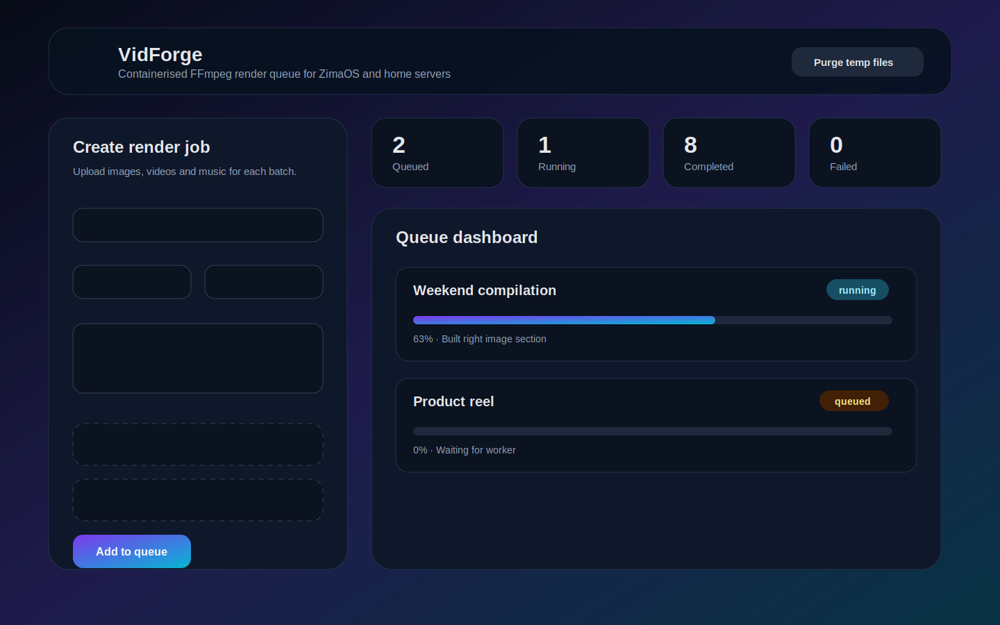
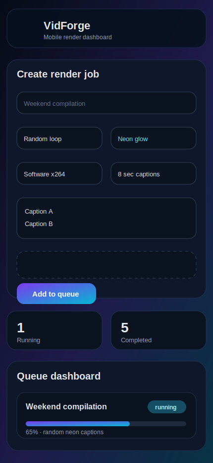

<p align="center">
  
</p>

<h1 align="center">VidForge</h1>

<p align="center">
  A Docker-first FFmpeg render queue for ZimaOS and home servers.
</p>

<p align="center">
  <a href="https://github.com/backip210-pixel/vidforge">Repository</a> ·
  <a href="DEPLOYMENT.md">Deployment guide</a>
</p>



VidForge is a containerised web dashboard for creating the three-section FFmpeg compilations from your original macOS Bash script. It defaults to safe CPU rendering so it works on AMD, Intel, ARM and VPS hosts without Apple-only `h264_videotoolbox` dependencies.

## Default deployment: Docker Compose

```bash
git clone https://github.com/backip210-pixel/vidforge.git
cd vidforge
docker compose up -d --build
```

Open:

```text
http://YOUR-ZIMAOS-IP:8080
```

The app creates and uses this persistent folder automatically:

```text
./data
```

For more deployment options, including GHCR image deployment and ZimaOS/CasaOS custom-app notes, see [`DEPLOYMENT.md`](DEPLOYMENT.md).

## What it does

- Upload a separate batch of images, videos, optional music and captions per job.
- Stores each job under the Docker-mounted `data/jobs/<job-id>` folder.
- Renders one job at a time with a lightweight built-in queue so FFmpeg processes do not collide.
- Writes finished MP4 files to `data/outputs`.
- Uses isolated per-job temp folders under `data/tmp/<job-id>`.
- Deletes a job's temp folder after completion and includes a 12-hour temp-folder cleanup task.
- Provides live progress, logs, requeue, delete and download actions from a responsive web UI.
- Lets users type captions directly or upload a UTF-8 `.txt` caption file.
- Loops captions across the video in either random order or sequential order.
- Supports caption styling: white text with cyan/purple neon glow or classic boxed captions.
- Supports 2560×1440 and 3440×1440 ultrawide layouts.
- Supports software x264 by default plus optional VAAPI, Intel QSV and NVIDIA NVENC selections.
- Includes an application logo, web favicon/manifest, compose metadata labels and screenshots.

## Docker files included

| File | Purpose |
| --- | --- |
| `Dockerfile` | Builds the VidForge app image with Python, FFmpeg and fonts. |
| `docker-compose.yml` | Default ZimaOS/local deployment. Builds from source and tags `ghcr.io/backip210-pixel/vidforge:latest`. |
| `docker-compose.ghcr.yml` | Optional deployment using the prebuilt GitHub Container Registry image. |
| `.github/workflows/docker.yml` | Builds and publishes the Docker image to GHCR on pushes to `main`. |
| `DEPLOYMENT.md` | Detailed Docker, ZimaOS and GHCR deployment instructions. |

## Folder layout after deployment

```text
data/
  jobs/
    <job-id>/
      input/
        images/
        videos/
        music/
        captions.txt
      render.log
  outputs/
    your_finished_render.mp4
  tmp/
    <job-id>/        # working files, automatically purged
  jobs.json          # queue state
```

## ZimaOS deployment via GitHub Desktop

Since you plan to use GitHub Desktop:

1. Open this `vidforge` folder in GitHub Desktop.
2. Publish/push it to:

   ```text
   https://github.com/backip210-pixel/vidforge
   ```

3. On ZimaOS, clone/import the repository.
4. Start it with Docker Compose:

   ```bash
   docker compose up -d --build
   ```

5. Visit:

   ```text
   http://<zimaos-ip>:8080
   ```

The compose file also contains app metadata and a logo URL for ZimaOS/CasaOS-style custom app workflows.

## Caption options

Each render job can use captions typed into the dashboard and/or uploaded from a UTF-8 `.txt` file. Use one caption per line.

Caption ordering options:

- **Random loop**: shuffles the caption pool and keeps looping it across the whole video.
- **Sequential loop**: repeats captions in the order provided.

Caption style options:

- **White + neon glow**: bright white foreground text with cyan/purple neon highlighting.
- **Classic boxed text**: the simpler high-contrast black box style.

## Encoder choices

The original script used macOS `h264_videotoolbox`, which will not work in Linux Docker on an AMD ZimaOS server. VidForge defaults to:

- **Software x264**: safest, portable, recommended first option.

Optional advanced encoders are available in the UI:

- **VAAPI**: AMD/Intel Linux hardware encoding. Requires mounting `/dev/dri:/dev/dri` in `docker-compose.yml` and host driver support.
- **Intel QSV**: Intel Quick Sync systems.
- **NVIDIA NVENC**: NVIDIA hosts with the NVIDIA container runtime.

If hardware rendering fails, requeue the job with **Software x264**.

## Application logo

The application logo is included here:

```text
app/static/logo.svg
docs/logo.svg
```

The dashboard uses it as the header logo and favicon. The Docker Compose metadata also exposes the raw GitHub icon URL:

```text
https://raw.githubusercontent.com/backip210-pixel/vidforge/main/app/static/logo.svg
```

## Optional basic authentication

For LAN-only use you can leave auth disabled. To enable browser basic auth, uncomment these environment variables in `docker-compose.yml`:

```yaml
environment:
  APP_USERNAME: admin
  APP_PASSWORD: change-me
```

Restart afterwards:

```bash
docker compose up -d
```

## Screenshots

### Desktop


### Mobile



## Development

Run without Docker:

```bash
python -m venv .venv
source .venv/bin/activate
pip install -r requirements.txt
APP_DATA_DIR=./data python -m app.main
```

The container image installs FFmpeg and DejaVu fonts automatically.

## Notes

- Uploaded files are intentionally stored in `data/jobs/<job-id>/input` for reproducibility and requeueing.
- Temporary FFmpeg intermediates are stored in `data/tmp/<job-id>` and removed after a successful or failed render. A periodic cleanup also purges stale temp folders older than 12 hours when no job is using them.
- The queue is intentionally single-worker to avoid heavy FFmpeg jobs colliding on a small home server.
